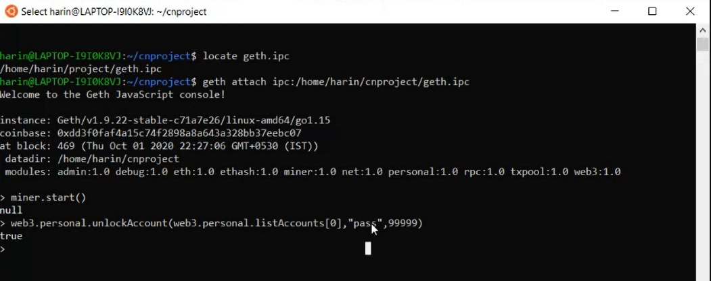
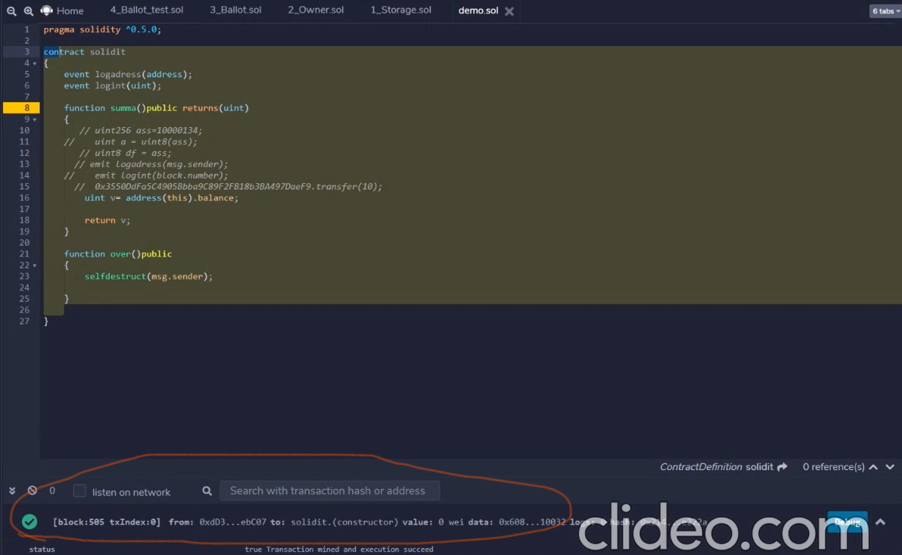

# Private-Blockchain---Geth
* An Ethereum Private Network is a private Blockchain which is completely isolated from the Ethereum Mainnet . 
The nodes that are active in this network are restricted only to this private Blockchain . 
It is like a centralized network that does not resonate with the basic Blockchain concept , but offers partial decentralization .
It is mostly created by small organizations to controll and deny read permissions of the Blockchain . 
Users / Nodes with the right permissions will be able to access the Blockchain . 
The main purpose for which the organizations use it is to store private data which should not be accesible to people outside their organization .  

* Geth is an Ethereum client written in GO language , which is used to connect to real chain or start your own testnet server. 
Geth program serves as a node for Ethereum chain and by which a user can create a RPC enabled private network , mine Ether and create an application that runs on the EVM . 
The Applications can comprise things like decentralized applications , cryto tokens etc.. .

📖-**Instructions**
* Install Geth and Puppeth network manager.
* Install WSL if your OS is windows (Only if additional layer of security is needed ) .
* Download all three Batch Files.
* Run First Batch file -> type "genesis" in first line -> configure new genesis -> select Ethash/Clique 
-> set newtwork id as "1234" -> Manage existing genesis -> Export genesis configuration -> Ctrl+c and exit.
* Run Second Batch file.
* Set Password for both the accounts .
* Run Third Batch File .
* To Enable Security from unauthorized access: Use commands : sudo ufw default allow outgoing and sudo ufw default deny incoming . Then configure IpTables . 
* Else run the batch file .
* Start miner . cmd : miner.start() .

* Then Unlock accounts and connect with smart contract if needed.Once Authentication is successful and the account is unlocked , it will be reflected in the remix ide .Now the smart contract is ready to run . Finally deploy the smart contract. 

